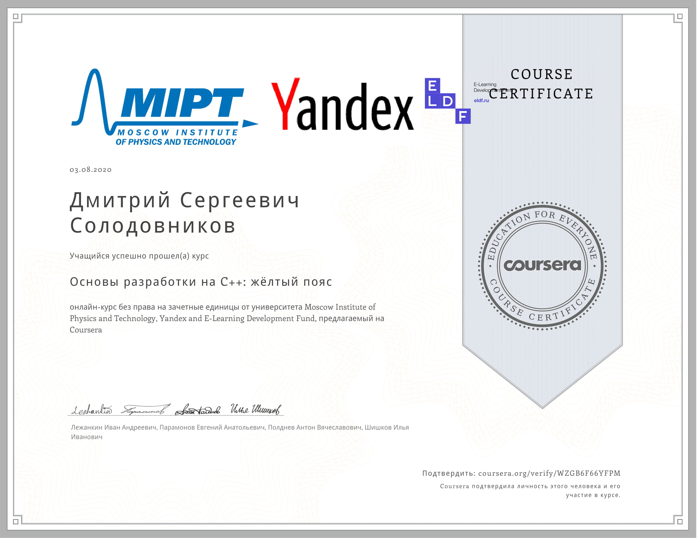

# [Основы разработки на C++: Жёлтый пояс](https://www.coursera.org/learn/c-plus-plus-yellow)

# Disclaimer - ENG
All of the material in this repo created and shared 
with respect for [Coursera Honor Code](https://learner.coursera.help/hc/en-us/articles/209818863-Coursera-Honor-Code).
All my solutions provided to show my skills. All authors
solutions provided to ensure that I am not claiming authors
solutions as mine. All printed material provided to show context 
(task descriptions) or for educational purposes (week summaries). 
You can use this repo for all not prohibited ways. 
You can not use it to violate Coursera's Honor Code or 
other rules. If You still have any concerns about repo, 
You should contact me through mail, provided 
in GitHub profile description.

# Дисклеймер - РУС
Все материалы в этом репозитории созданы и распространяются 
с уважением к [Правилам поведения Coursera](https://learner.coursera.help/hc/en-us/articles/209818863-Coursera-Honor-Code).
Все мои решения размещены для подтверждения моих навыков. 
Все авторские решения размещены для подтверждения того, 
что я не выставляю их за свои. Все печатные материалы 
размещены чтобы показать контекст (условия задач) или 
для обучающих целей (конспекты недель). 
Вы можете использовать репозиторий всеми незапрещенными 
способами. Вы не можете использовать этот репозиторий 
для нарушения правил Coursera или других правил. 
Если у вас оставлись претензии к содержимому репозитория, 
Вы должны связаться со мной при помощи почты,
указанной в описании профиля GutHub.

# Certificate

